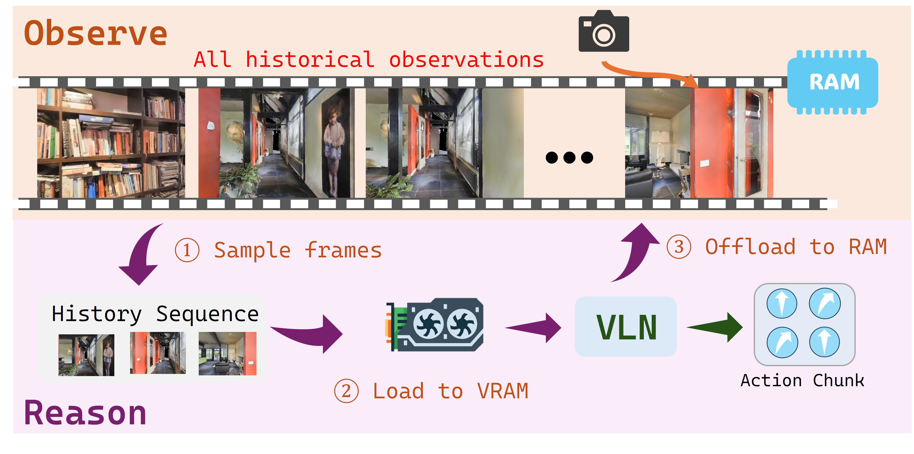
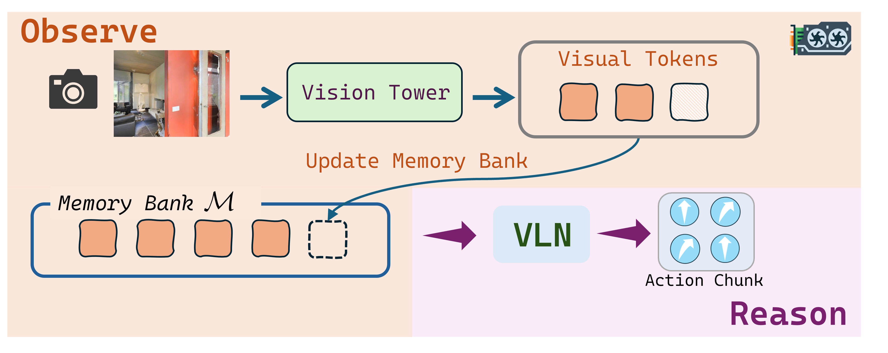
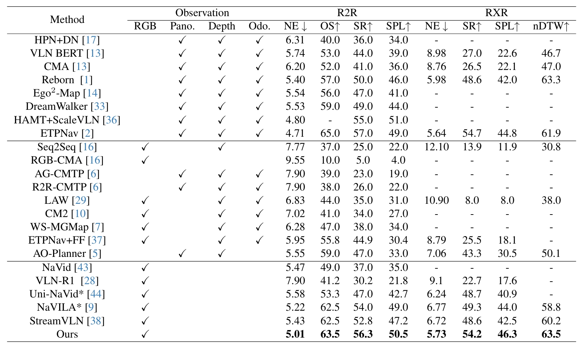

<h1 align="center">DecoVLN: Decoupling Observation, Reasoning, and Correction for Vision-and-Language Navigation</h1>

<p align="center">
  <a href="(https://allenxinn.github.io/DecoVLN)"></a>
  <!-- <a href="https://arxiv.org/abs/2603.13133"> -->
  <a href="https://arxiv.org/abs/2603.13133"></a>
  <!-- 
   -->

<!--
<p align="center">
  <strong>Zihao Xin</strong><sup>1,*</sup>,
  <strong>Wentong Li</strong><sup>1,*†</sup>,
  <strong>Yixuan Jiang</strong><sup>1</sup>,
  <strong>Bin Wang</strong><sup>2</sup>,
  <strong>Runmin Cong</strong><sup>2</sup>,
  <strong>Jie Qin</strong><sup>1,✉</sup>,
  <strong>Sheng-Jun Huang</strong><sup>1,✉</sup>
</p>

<p align="center">
  <sup>1</sup>Nanjing University of Aeronautics and Astronautics
  <br>
  <sup>2</sup>Shandong University
  <br>
  <sup>*</sup>Co-first Authors, 
  <sup>†</sup>Project Lead, 
  <sup>✉</sup>Corresponding Authors
</p>

-->


<p align="center">
  
</p>


## Highlights

- **Observation-Reasoning Decoupling**: the agent perceives continuously while selectively compressing historical information into a memory bank.
- **Adaptive Memory Refinement**: memory construction is formulated as an optimization process balancing relevance, diversity, and temporal coverage.
- **Corrective Finetuning**: state-action pair filtering improves robustness against compounding errors.
- **Strong Empirical Performance**: DecoVLN achieves leading results under fair settings without global priors or multi-sensor inputs.
- **Real-World Deployment**: the method has been validated beyond simulation with real-world demos.

## Efficiency

<p align="center">
  
  
</p>

DecoVLN departs from the conventional paradigm of storing large historical observation sequences and repeatedly moving sampled frames between RAM and VRAM. Instead, it maintains a **VRAM-resident memory bank** populated by an adaptive refinement mechanism that preserves high-value semantic information during the observation phase and feeds it directly into the VLN model during inference.

## Real-world Deployment

<p align="center">
  
</p>

## Experimental Results

<p align="center">
  
</p>

DecoVLN achieves the best performance among prior methods under fair comparison settings, without relying on global priors or additional sensor modalities.

## TODO
- [x] Release the paper link and BibTeX entry
- [ ] Release the dataset
- [ ] Open-source training and inference code
- [ ] Release pretrained model checkpoints
- [ ] Add installation and environment setup instructions

## Citation
```latex
@misc{xin2026decovlndecouplingobservationreasoning,
      title={DecoVLN: Decoupling Observation, Reasoning, and Correction for Vision-and-Language Navigation}, 
      author={Zihao Xin and Wentong Li and Yixuan Jiang and Bin Wang and Runming Cong and Jie Qin and Shengjun Huang},
      year={2026},
      eprint={2603.13133},
      archivePrefix={arXiv},
      primaryClass={cs.RO},
      url={https://arxiv.org/abs/2603.13133}, 
}
```